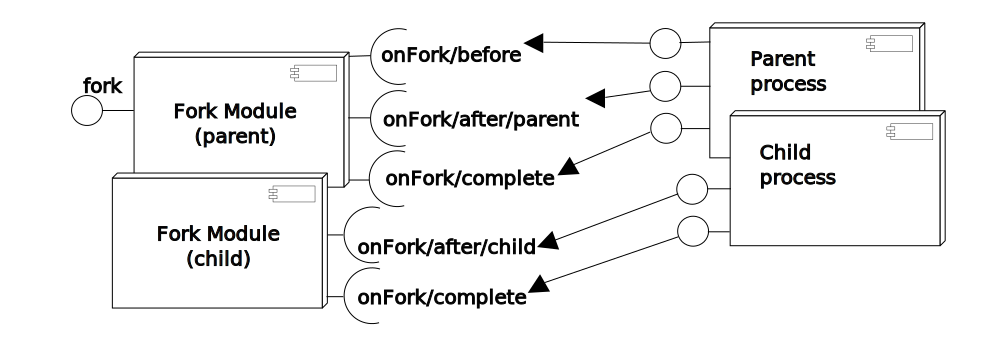

Fork
========

The idea of fork is to create new process and make them available as worker to the parent process. This helps to implement the actor model of concurrency.

The process have the following properties.
- The process by definition does not share the memory with others( other processes ).
- The processes may communicate with pipes and they may keep contact with the parent console.

Events
=======
- onFork/before
- onFork/error
- onFork/after/child
- onFork/after/parent
- onFork/complete

[component diagram](../../docs/diagrams/spawning_process.svg)


Example
========

#### Spawning a process
The console module uses fork module to display the available process as jobs like in linux job command.

```
<            echo> -----------------------------------------------------------------
 Welcome to opensource shotodol environment. This toy comes with no guaranty. Use it at your own risk.

<      Successful> -----------------------------------------------------------------
<           shake> -----------------------------------------------------------------
<          module> -----------------------------------------------------------------
<      Successful> -----------------------------------------------------------------
<        fileconf> -----------------------------------------------------------------
<      Successful> -----------------------------------------------------------------
<      Successful> -----------------------------------------------------------------
Started idle stepping ..
rehash
Executing:rehash
<          rehash> -----------------------------------------------------------------
<          script> -----------------------------------------------------------------
Rehashing lua modules
luaGoodLuckregistering luaGoodLuck hook
<      Successful> -----------------------------------------------------------------
<      Successful> -----------------------------------------------------------------

jobs
Executing:jobs
<            jobs> -----------------------------------------------------------------
0 Jobs
<      Successful> -----------------------------------------------------------------

fork
Executing:fork
<            fork> -----------------------------------------------------------------
<      Successful> -----------------------------------------------------------------

<      Successful> -----------------------------------------------------------------

jobs
Executing:jobs
<            jobs> -----------------------------------------------------------------
1 Jobs
<      Successful> -----------------------------------------------------------------
```

#### Sending command to child process

The console module has jobs command to execute a command on the child. For example, `jobs -x 0 -act ping` will *ping* the child at 0. And if there is a child at position 0 then it will response a *pong*.

```
ping -x 0 -act ping
Executing:ping -x 0 -act ping
<            ping> -----------------------------------------------------------------
pong
<      Successful> -----------------------------------------------------------------

jobs
Executing:jobs
<            jobs> -----------------------------------------------------------------
1 Jobs(parent)
<      Successful> -----------------------------------------------------------------

jobs -x 0 -act jobs
Executing:jobs -x 0 -act jobs
<            jobs> -----------------------------------------------------------------
<      Successful> -----------------------------------------------------------------

Executing:jobs
<            jobs> -----------------------------------------------------------------
1 Jobs(child)
<      Successful> -----------------------------------------------------------------

```

Interprocess communication
==========================

The processes can communicate with [ForkStream](vsrc/ForkStream.vala). The *ForkStream* must be initiated with onFork_Before() and fixed up with onFork_After() .

The [ForkableConsole](../console/vsrc/ForkableConsole.vala) uses *ForkStream* for interprocess communication.

