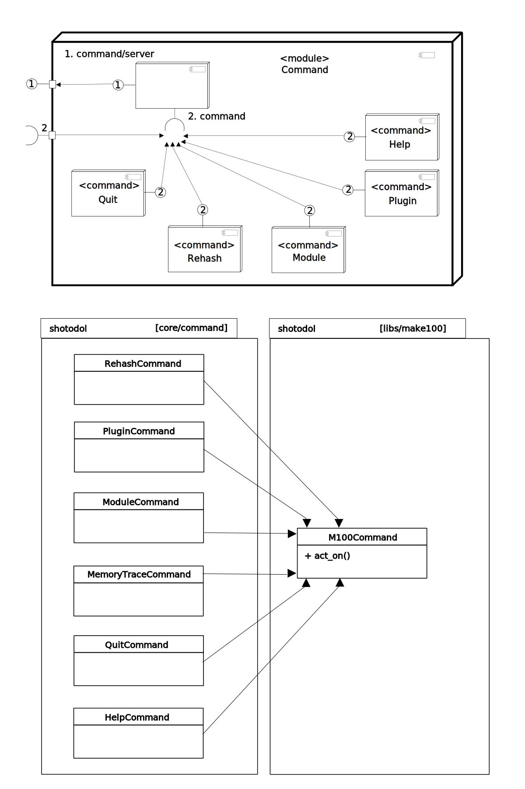

Shotodol programming and design patterns
=========================================

#### Encapsulation

[Modules](../../../libs/module/README.md) provide encapsulation in shotodol. You can hide your inner workings in modules and still be able to advertise your extensions registering as [plugins](../../../libs/plugin/README.md). 

In the following diagram the _iostream_ encapsulates the input output constructs of shotodol.

#### Composite Pattern

Writing extensions in a plugin space is an example of composite pattern. See [extensions](../../../libs/plugin/README.md#extension).

The following diagram displays the composition of commands under _command/server_ .

The following diagram displays the composition of fibers.

#### Inheritance

The [bundler](../../../libs/bundle/) has an inheritance pattern.

#### Design by contract

The interface extensions are examples of [design by contract](http://en.wikipedia.org/wiki/Design_by_contract).

#### Readings

- [Plugin Oriented programming](http://miniim.blogspot.com/2014/09/plugin.html)
- [Data Oriented programming talk](github.com/kamanashisroy/aroop/tree/master/talks/data_oriented_talks)
- [Drupal OOP](https://www.drupal.org/node/547518)
- [When OOP do not fit](http://technosophos.com/2010/10/13/why-object-oriented-programming-bad-drupal.html)
